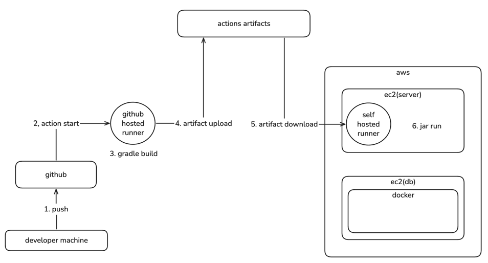

# 레벨3 최종미션 문서

# 인프라 특징

해당 프로젝트의 인프라는 '내가 1인 개발자라면' 이라는 큰 전제하에 구성되었다.
이런 전제가 있다보니, 인프라 구성의 가장 중요한 1원칙은 '내가 이해하기 쉬운가'였다.
내 경험을 돌이켜보며 어떤 구성방식을 택하는 것이 가장 간단하고 직관적인지 고민했고, 최소의 요구사항을 지키며 간단하게 구현했다.

# 인프라 구성 요소

- `github hosted runner`
  - 깃헙에서 제공하는 action runner이다.
  - 배포시 gradle 빌드와 아티팩트 업로드를 담당한다.
- `self hosted runner`
  - EC2 인스턴스에 설치되는 action runner이다.
  - EC2에 외부에서 접근이 불가하기 때문에 사용된다.
  - 배포시 아티팩트 다운로드와 서버 실행을 담당한다.
- `actions artifacts`
  - 깃헙 아티팩트 저장소이다.
  - 두 action runner간에 jar 파일 공유를 위해 사용된다.
- `ec2(server)`
  - 애플리케이션 서버이다.
  - AWS EC2 인스턴스이다.
  - 내부적으로 애플리케이션의 jar 파일이 80포트로 실행되고 있다.
- `ec2(db)`
  - 데이터베이스 서버이다.
  - AWS EC2 인스턴스이다.
  - 내부적으로 docker를 활용하여 mysql이 3306포트로 실행되고 있다.

# 배포 방식 선택 이유

## 배포 트리거 방식

배포를 트리거하는 방식에는 크게 2가지 방식을 생각했는데, 첫번째는 쉘스크립트였고, 두번째는 깃헙액션이었다.
쉘스크립트의 경우 아직 익숙해지지 않았고, git push시 자동으로 실행되게 하기 위해서는 hook에 대해서 추가 학습이 필요했다.
이에 비해 깃헙액션은 우테코 팀프로젝트나 다른 동아리 활동에서도 사용해보았기 때문에 매우 익숙했다.

쉘스크립트를 학습하여 얻는 이득이 있나 고민해보았지만, 이득이 없었기 때문에, 깃헙액션을 활용하게 되었다.

## 실행가능한 코드를 EC2까지 올기는 방식

코드를 EC2에 옭기기 위해서는 이미 존재하는 git과 github를 그대로 사용하는 방식, github action의 artifact를 활용하는 방식, 그리고 dockerhub를 통하는 방식이 존재했다.
git과 github를 그대로 사용하는 방식이 편하고 직관적이나, gradle 빌드를 EC2 내부에서 하게 된다는 점이 문제다. 이러면 EC2의 메모리 리소스를 많이 잡아먹게 되는데, EC2가 뻗어버릴지도 모르는
상황이다.
또한 artifact 방식은 여러 action runner를 사용하는 현재 시점에서 꽤나 잘 어울린다고 생각했다.
마지막으로 dockerhub를 통하는 방식은 아직 익숙해지지는 않았지만 우테코 팀프로젝트에서도 적용하고 있는 방식이었다.

git과 github를 사용하는 방식은 위의 단점 때문에 제외하고, 나머지 두 방식 중에 고민했는데, 비교적 dockerhub 방식을 많이 사용해보았고, artifact 방식은 학습하기도 매우 간단하고
github에서 제공한다는 점에서 추가로 의존하는 대상이 적다는 점이 매력적으로 느껴졌다. 또한 dockerhub 쪽은 많이 사용해보았긴 하지만, 환경변수를 주입하는 지점에서 배포 스크립트의 복잡성이 올라가는 경험을
해서 싫었다.

따라서 artifact 방식을 사용하게 되었다.

## DB 서버 방식

요구사항에 애플리케이션 서버와 DB 서버의 물리적 네트워크를 구분하라는 내용이 있었기 때문에, 동일 EC2에서 DB를 띄울 수 없게 되었다.
따라서 DB를 다른 곳에 띄워야했고, EC2에 띄우는 것과 RDS를 활용하는 것 중에 고민하게 되었다.

RDS는 EC2를 직접 사용하는 것에 비해 비용이 비싼 편이지만, 백업/모니터링/복구 등의 관리 비용이 현저하게 줄어드는 장점이 있다. 하지만 이러한 장점들이 현재 서비스의 단계에서는 잘 느껴지지 않았고, 비용 또한
무제한이었기 때문에 크게 상관없었다.

가장 최근에 진행한 EC2로 띄우는 방식이 트러블슈팅에 유리할 것 같아 선택하게 되었다.

## DB를 띄우는 방식

DB를 EC2에 직접 설치하거나, docker를 통해서 띄우는 방식 중에 고민했는데, docker를 통해서 띄우는 방식으로 결정했다.

그 이유는 일단 ubuntu를 잘 모르기 때문에, 설치 과정에서의 명령어도 제대로 이해하지 못하고, 따라서 트러블슈팅이 거의 AI 위주로 이루어질 것 같았다.
반연에 docker 방식은 일단 docker를 설치하는 명령어는 제대로 아카이빙 해두었고 (현재 EC2와 동일한 환경) 따라서 docker 설치는 문제가 없으며, 그 이후로는 트러블슈팅에 자신있었다.

따라서 docker를 띄우는 방식을 선택했다.
